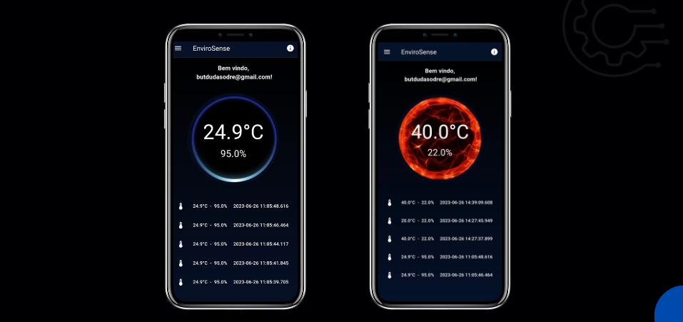

<div align="center">
	
	<br/>
	<br/>
</div>

# Envirosense - Temperature Alert System

## Introduction

This mono-repository contains the source code for:
- Arduino-based alert system.
- Serverside API + NoSQL database.
- Flutter-based reports application.

The system is designed to notify responsible parties about thermal overheating in server rooms.

Thermal overheating in server rooms is a common issue in IT infrastructure. It refers to the excessive increase in temperature within the environment housing the servers, which can result in equipment damage and potentially lead to failures and service interruptions.

Preventing and controlling thermal overheating is crucial to ensure the reliable operation and longevity of IT equipment, as well as to avoid service disruptions.

This README provides instructions on how to set up and configure the Arduino code to work within your specific environment.

## Repository Structure

The repository is organized into the following components:

- **Arduino Alert System:**
  This section contains the Arduino code responsible for collecting temperature data and sending it to the API. Follow the steps below to set it up.

- **Server-side API + NoSQL Database:**
  This section contains the code for the server-side API and NoSQL database. This API receives temperature data from Arduino devices and stores it in the database for later analysis.

- **Flutter Reports Application:**
  Here, you'll find the Flutter-based application for visualizing temperature reports generated from the collected data. This app provides insights and trends based on the data stored in the database.

## Getting Started

Follow the steps below to get the Arduino code up and running on your device:

1. **Clone the Repository:** Start by cloning this repository to your local machine using the following command:

    ```
    git clone https://github.com/fonsecaBarreto/sig-sensor
    ```
2. **Open Arduino IDE:**
Launch the Arduino IDE on your computer.

3. **Modify Configuration:**
- Open the `index.ino` file in the Arduino IDE.
- Locate the following lines of code:

  ```cpp
  const char* ssid = "wifi name";
  const char* password = "wifi password";
  ```

- Replace `"wifi name"` with your Wi-Fi network name and `"wifi password"` with the corresponding password.

- Find the line defining the API URL:

  ```cpp
  const char* API_URL = "http://localhost:9000/metrics";
  ```

- Update the URL to match the actual API endpoint where you want to send the temperature data.


1. **Upload the Code:**
- Click the "Upload" button in the Arduino IDE to compile and upload the code to your Arduino device.


## Flutter App

Below is a mockup of the Temperature Reports Application:

<div align="center">
	
	<br/>
	<br/>
</div>


## Usage

Once all components are set up, the Temperature Alert System will collect and send temperature data to the API, which will then store it in the NoSQL database. You can use the Flutter Reports Application to visualize and analyze the temperature reports generated from the collected data.

Feel free to customize the code, add features, and adapt the system to your specific requirements.

## Contributing

If you would like to contribute to this project, we welcome your contributions. Feel free to fork the repository, make your changes, and submit a pull request.

## License

This project is licensed under the [MIT License](LICENSE), allowing you to use, modify, and distribute the code as long as you include the original license in your distribution.

---

We hope this README guides you through the setup and usage of the Temperature Alert System. For any questions or assistance, don't hesitate to reach out. Happy coding!
